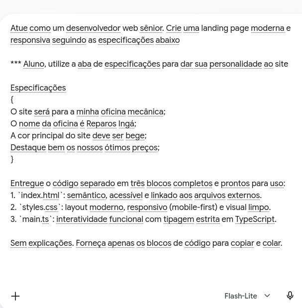
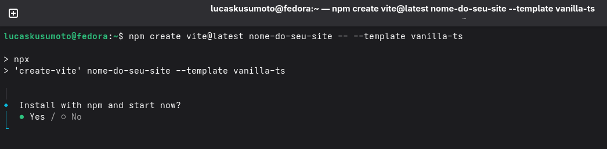

# Hoje  não teremos teoria
Abram o Gemini ou o ChatGPT no navegador de vocês

---

### O que vamos fazer na aula de hoje?
- Criar um site funcional personalizado do zero com IA;
- Salvar nosso progresso no GitHub.

---

# *Vamos começar!*

---

- **Nosso primeiro passo será pedir para a IA criar o template do nosso site.**

- **Sejam criativos nas especificações!**

- **Após isso, nós teremos o código em mãos...**

- **Mas como transformá-lo em um site?**

---

# Passo 2
### Criando um template (esqueleto)

---

- **abra o Terminal do seu computador;**
- **Digite o comando abaixo e selecione "yes";**

---

- **O  que esse npm bla bla bla quer dizer?**
- **O npm é um gerenciador de arquivos;**
- **nesse comando, nós estamos pedindo para ele criar um: template (modelo) vanilla (padrão) para o nosso site feito na linguagem TypeScript, por isso o -ts no final;**

---

- **Ele gerou um link local!**
- **Se você copiar e colar ele no navegador, vai ver que agora temos um site no ar.**
- **Mas por enquanto esse é só o modelo genérico do npm...**

<pre class="terminal-box"><code>◇  Starting dev server...

> nome-do-seu-site@0.0.0 dev
> vite

  VITE v8.3.1  ready in 560 ms

  ➜  Local:   http://localhost:5173/
  ➜  Network: use --host to expose
  ➜  press h + enter to show help</code></pre>

  ---
  # Passo 3
  ### Personalizando nosso template (esqueleto)
  ---

  